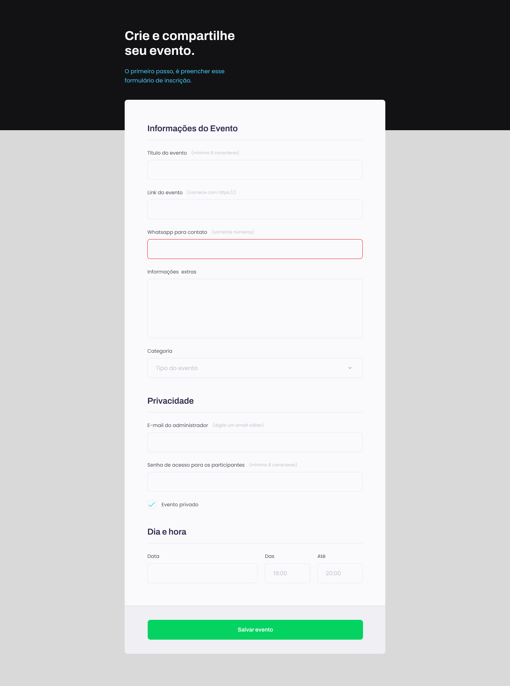

<h1 align="center"> Formulário de Inscrição </h1>

Rocketseat, escola de desenvolvedores 

  <a href="#-tecnologias">Tecnologias</a>&nbsp;&nbsp;&nbsp;|&nbsp;&nbsp;&nbsp;
  <a href="#-projeto">Projeto</a>&nbsp;&nbsp;&nbsp;|&nbsp;&nbsp;&nbsp;
  <a href="#-layout">Layout</a>&nbsp;&nbsp;&nbsp;|&nbsp;&nbsp;&nbsp;
  <a href="#memo-licença">Licença</a>&nbsp;&nbsp;&nbsp;|&nbsp;&nbsp;&nbsp;
  <a href="#-formulario">Formulário</a>

  

 

  

## 🚀 Tecnologias

Esse projeto foi desenvolvido com as seguintes tecnologias:

- HTML e CSS
- Git e Github

## 💻 Descrição

Essa interface é um formulário de inscrição que possui validação de campos e customizações avançadas de css. 

- [Acesse o projeto finalizado, online](https://andresa43.github.io/formulario-inscricao/)

## 🔖 Layout

Você pode visualizar o layout do projeto através [DESSE LINK](https://www.figma.com/file/kBMLJ4WmDFTtrDkbjmzIaI/Explorer-Stage-03-Projeto-01-(Copy)?node-id=1-28&t=piS3S9lEOBvseLS2-0). É necessário ter conta no [Figma](https://figma.com/) para acessá-lo.

## :memo: Licença

Esse projeto está sob a licença MIT.

---

 Feito com ♥ Rocketseat :wave: [Acesse a comunidade!](https://www.rocketseat.com.br/)
